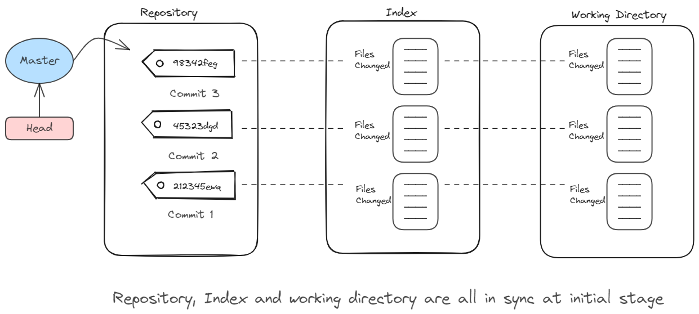
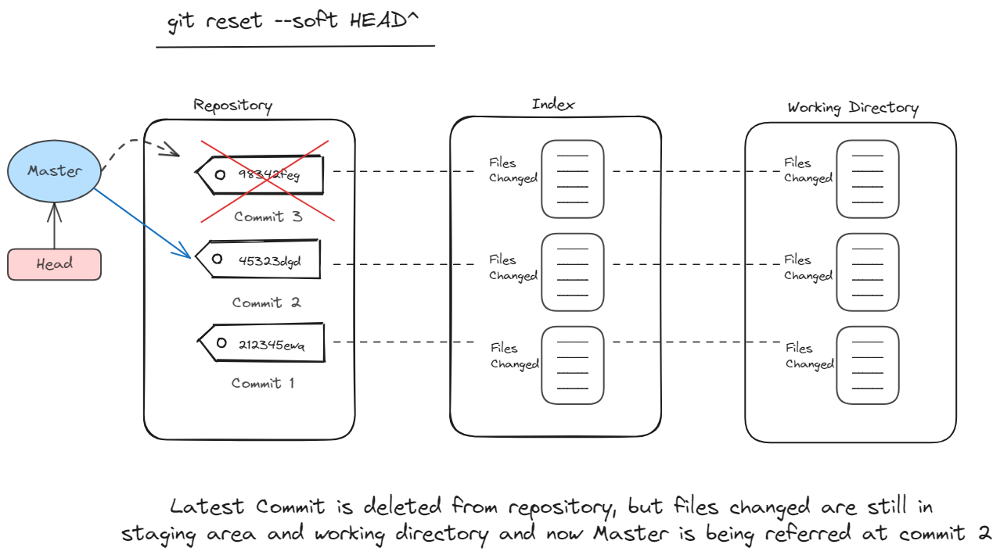
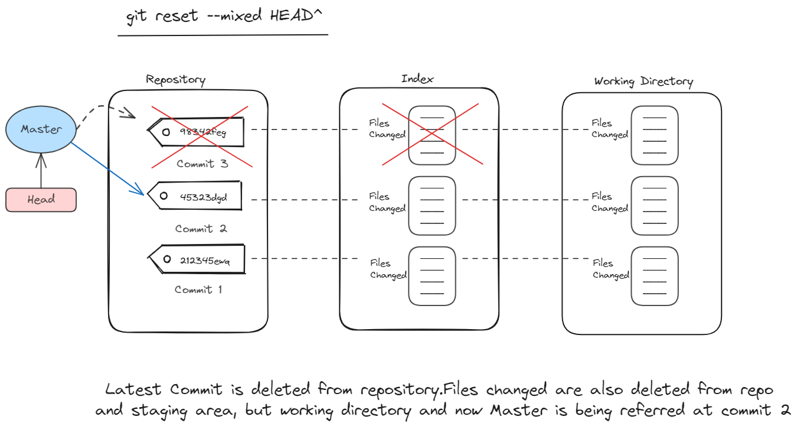
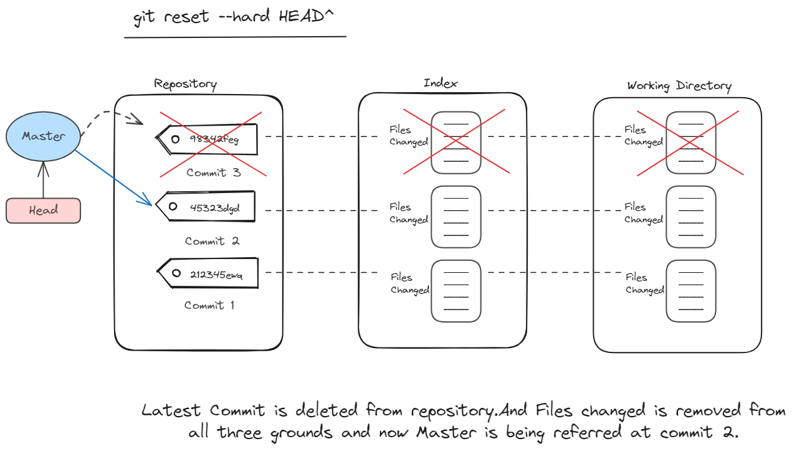

# Git Reset

If you have ever done commit on wrong branch locally before pushing it on github repo, git reset has always come to help us out of those situation. As git reset have three options- soft, mixed and hard, this created confusion for the beginners that when to use them. But before learning about those three options let's learn about three main areas where your project's files reside:-

1. **Working Directory**: 
This is your project folder on your local machine where you actively edit and create files.     It is where you make changes to your code.

2. **Staging Area (Index)**:
Think of this as a temporary holding area for the specific changes you want to include in your next commit. You use the git add command to add files or changes from your working directory to the staging area.

3. **Repository**:
This is the central storage for all your committed versions of the project. It holds the complete history of changes, including snapshots of your files at each commit point. The repository is typically stored in a hidden folder named **.git** within your working directory.

Now lets go through visualisation of git reset:-

This is the initial stage where we have some commits saved in repository and everything is in sync.

Using github reset --soft, removes the latest commit from repo but keeps the files changed staged in index and working directory. To create the new commit, we need to create another commit using git commit -m "commit-message"

Using github reset --mixed, removes the latest commit from repo and files changes staged in index but keeps the file changed staged in working directory. To create the new commit, we need to have to do git add . and then git commit -m "commit-message" to create the latest commit on previous commits.

Using github reset --hard is a danger and need to be handled with precautions.It removes the latest commit from repo and also all the changes related to that commit from index as well as working directory. Giving you the repo as it was earlier before that latest commit.

So, this was about git reset --options. If you have any doubt or issue then you can raise a PR for it.